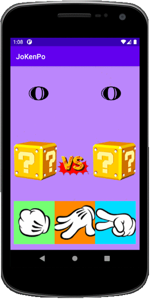

## JoKenPo Java Android
I wanted to get an idea of ​​what it would be like to develop an Android application using Java language. So, together with Professor Tito Petri, instructor of Udemy's Android course, I developed my first very simple Android application for demo and added some ideas that I had myself.

<h4 align="center">Screenshots ✨</h4>

